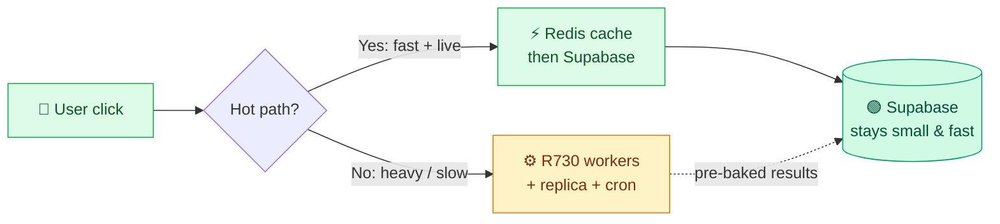
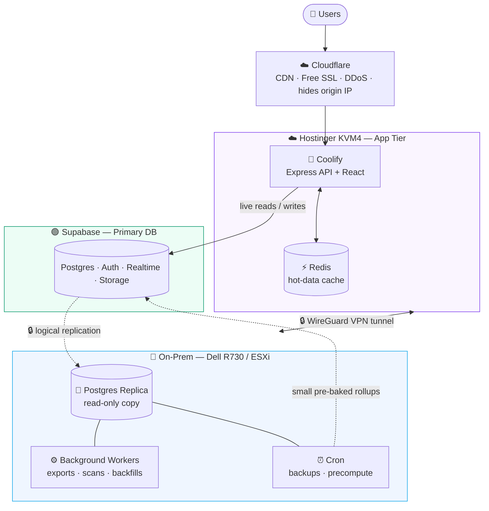
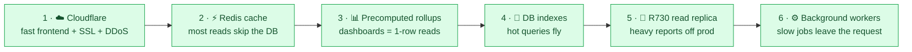
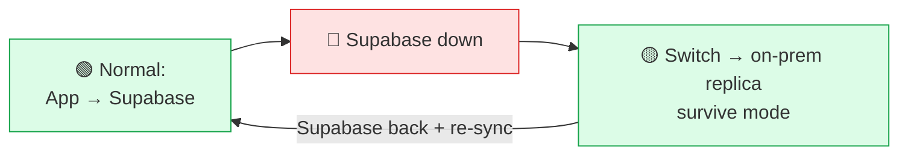

# 🏗️ BizTrix CRM — Infrastructure & Scaling Architecture

**Make it instant. Keep it cheap. Scale for years.**

---

## 📌 TL;DR

BizTrix CRM runs on a small, cheap cloud stack today. As users and data grow, the **database becomes the bottleneck**. The cloud answer is *"pay for a bigger database."* Ours is smarter:

> **Offload the heavy work to hardware we already own, cache the hot data at the edge of the app, and pre-bake expensive results — so the small, cheap database stays fast for years.**

We go **faster** *and* keep the bill **flat**.

---

## 🎯 The Problem

| | Today | In ~2 years |
|---|---|---|
| **Users** | Current team | Many more |
| **Data** | ~6k sales + transfers + chat | Much larger |
| **DB** | Supabase **"Small" compute (~$37/mo)** | Same Small compute **saturates** |
| **Cloud "fix"** | — | Upgrade to Medium/Large = **$110–$400+/mo** |

The Small Supabase compute is modest. Every dashboard, report, and list hits it directly. More traffic → it slows down → the whole CRM feels slow.

---

## 💡 The Strategy — Offload, Don't Upgrade

**Golden rule:** the *hot path* (what a user waits on) stays in the cloud, low-latency. The *heavy, slow, async* work goes to the on-prem server and feeds back pre-computed results. **The on-prem box is never in the middle of a click.**

---

## 🗺️ Target Architecture

### The three tiers

| Tier | Where | Job | Why there |
|---|---|---|---|
| 🚀 **App** | Hostinger **KVM4** (4 vCPU · 16 GB · NVMe) | Express + React **+ Redis cache** | Public, reliable, low-latency to users + DB |
| 🟢 **Database** | **Supabase** (Pro + Small compute) | Primary: live reads/writes, Auth, Realtime | Managed = redundancy + auto backups (PITR) |
| 🏢 **On-Prem** | **Dell R730** ESXi (24 cores, big RAM/disk) | Replica · workers · backups · analytics | Hardware we own — idle CPU does the heavy lifting |

> 🔒 **Connection:** the R730 sits behind office NAT, so it joins the cloud over a **WireGuard VPN tunnel** — Postgres is **never** exposed to the public internet.

---

## ⚡ The Speed Stack (ranked by impact)

| # | Layer | What it speeds up | Lives on |
|---|---|---|---|
| 1 | **Cloudflare (free)** | Frontend load, TLS, security | Edge |
| 2 | **Redis cache** | Flags, config, permissions, dashboards, lookups | Hostinger |
| 3 | **Precomputed rollups** | KPIs / dashboards (no live aggregation) | Cron → Supabase |
| 4 | **Indexes** | Sales/transfers/portal queries | Supabase |
| 5 | **Read replica** | Data Analyzer, exports, big reports | R730 |
| 6 | **Background workers** | Exports, recording pre-scan, backfills, fan-out | R730 |

> **Cloudflare makes the app *load* fast. Redis + precompute make the *data* fast.** They're complementary — together the CRM feels instant end-to-end.

---

## 🛣️ Build Roadmap

```mermaid
gantt
    title Phased rollout (each step is a live win, low risk)
    dateFormat  X
    axisFormat  %s
    section ☁️ Cloud — start now (no on-prem needed)
    Cloudflare (CDN/SSL/DDoS)      :a1, 0, 1
    Redis caching layer            :a2, after a1, 1
    Precomputed dashboard rollups  :a3, after a2, 1
    Hot-path indexes               :a4, after a3, 1
    section 🏢 On-Prem — after RAM upgrade
    WireGuard tunnel               :b1, after a4, 1
    Postgres replica + backups     :b2, after b1, 1
    Background workers             :b3, after b2, 1
    section 🚀 Later — high availability
    Self-hosted Supabase stack     :c1, after b3, 1
    Proxy-based auto-failover      :c2, after c1, 1
```

**Phases 1–4 need nothing on-prem** — pure speed wins available immediately. Phases 5–7 light up the R730 once RAM is added.

---

## 🖥️ Hardware & Specs

### App — Hostinger KVM 4
| | |
|---|---|
| CPU | 4 vCPU (AMD EPYC) |
| RAM | 16 GB |
| Disk | 200 GB NVMe |
| Bandwidth | 16 TB / month · up to 1 Gbps |
| Runs | Coolify (Express + React) **+ Redis** |

### Database — Supabase
| | |
|---|---|
| Plan | Pro **+ "Small" compute** (~$37/mo) |
| Storage | ~9% used (small) |
| Features used | Postgres · Auth · **Realtime (chat)** · Storage |

### On-Prem — Dell PowerEdge R730 (ESXi 6.7)
| | |
|---|---|
| CPU | 24 × Intel Xeon E5-2650 v4 @ 2.2 GHz |
| RAM | 64 GB *(upgrading — currently the bottleneck)* |
| Storage | ~4 TB (SSD + HDD VMFS6 datastores) |
| Access | Full ESXi **root** · create-VM |
| Network | Local LAN `192.168.0.15` · static public IP(s) |

---

## 🌐 Domains

| Domain | Registrar | Points to | Notes |
|---|---|---|---|
| `vertexpakistan.com` | GoDaddy | **CRM app** → `crm.vertexpakistan.com` | Brand domain → behind **Cloudflare** |
| `vertexpakistan.tech` | Hostinger (free 1-yr) | **Coolify dashboard** → `manage.vertexpakistan.tech` | ⚠️ Expires in ~1 yr · admin-only · lock down |

---

## 🔐 Security Notes

- 🔒 **Coolify dashboard** (`manage.vertexpakistan.tech`) controls every deploy → restrict it (**Cloudflare Access** or **office-IP allowlist** + strong creds/2FA). Never leave it open.
- 🔒 **No public Postgres** — the on-prem replica is reachable only through the **WireGuard tunnel**.
- 🔒 **Hide the origin** — once Cloudflare proxies the CRM, firewall the VPS to accept web traffic **only from Cloudflare IPs**.
- 🔒 **Same JWT secret** across managed + self-hosted Auth, so logins stay valid if we ever fail over.

---

## 🛟 Disaster Recovery & Failover

- **Phase 1 (now):** on-prem **replica + nightly backups** = you can always recover. Switch is **manual** (~minutes), documented.
- **Phase 2 (later):** a health-checking **proxy** flips traffic automatically.
- **Phase 3 (optional):** full self-hosted Supabase stack as a hot standby.

> DR (you can recover) is **90% of the value for 20% of the effort**. True zero-touch auto-failover is the last 10% — added later, deliberately.

---

## 💰 Cost Snapshot

| Item | Cost |
|---|---|
| Hostinger KVM 4 | existing |
| Supabase Pro + Small compute | ~$37/mo |
| Cloudflare | **Free** |
| Redis (on existing VPS) | **Free** |
| Dell R730 (owned) | **Free** (electricity only) |
| **Net new monthly cost** | **≈ $0** |
| **Avoided** | Supabase Medium/Large compute **($110–$400+/mo)** |

---

**Built for speed. Designed to scale. Owned end-to-end.**

*BizTrix Ventures · Infrastructure Plan*

